**Sajilo Khata**

Nepal SMS Expense Tracker & Savings Goals

Technical Documentation • v1.0

Built with Flutter + Firebase • Supports all major Nepal banks & wallets • BS/AD dual calendar

A product by **RedPixel Labs**

---

# **1\. Project Overview**

Sajilo Khata is a Flutter mobile application that automatically tracks income and expenses by reading SMS messages from Nepali banks and digital wallets.

## **1.0 Screenshots**

### Authentication

| Login | Signup |
| :--------------------------------------: | :----------------------------------------: |
| 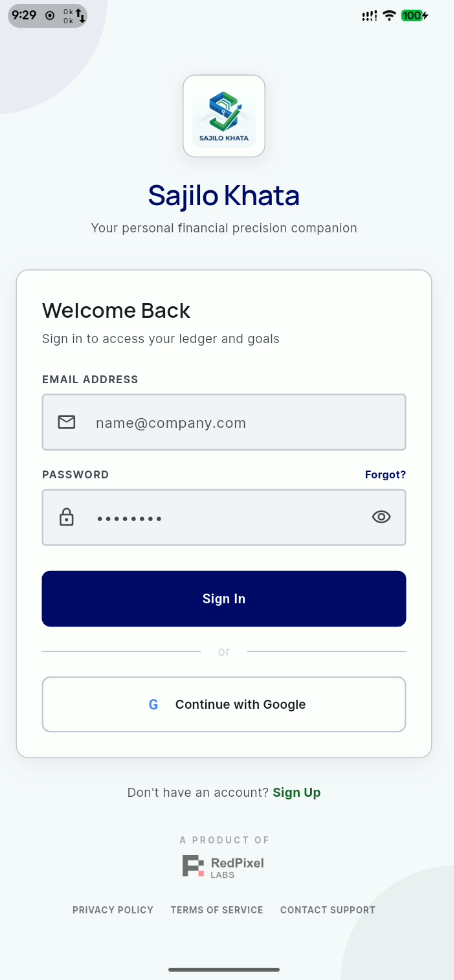 | 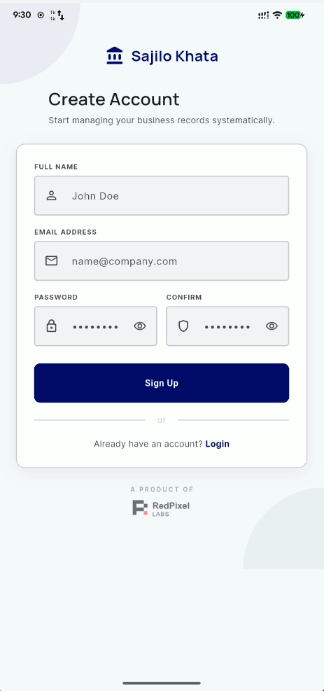 |

### Dashboard

| Main Dashboard | Monthly Summary |
| :---------------------------------------------------: | :---------------------------------------------------------: |
| 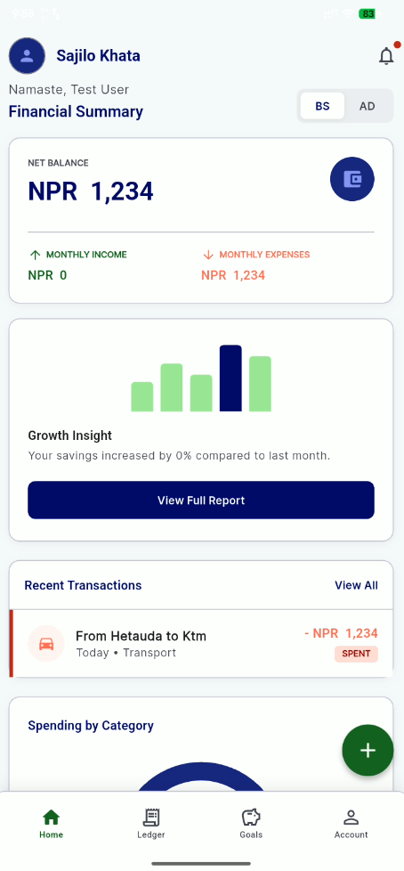 | 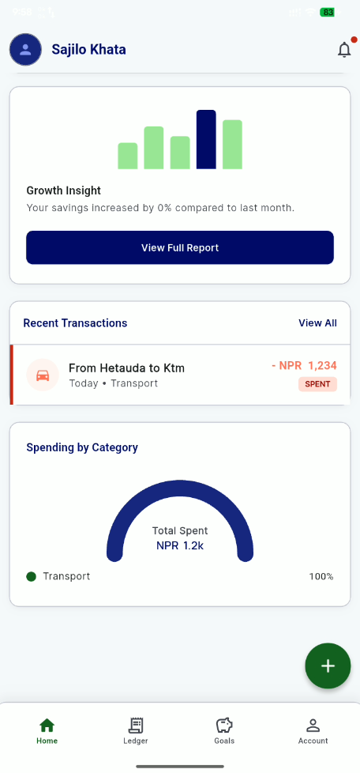 |

### Transactions

| Ledger | Add Transaction | Transaction Details |
| :--------------------------------------------: | :--------------------------------------: | :----------------------------------------------: |
| 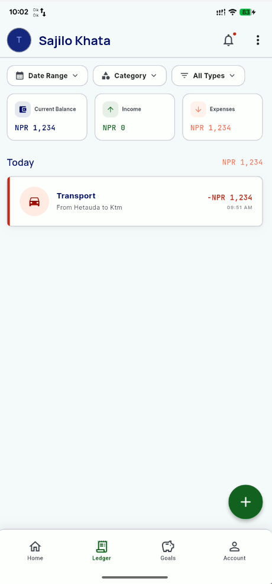 | 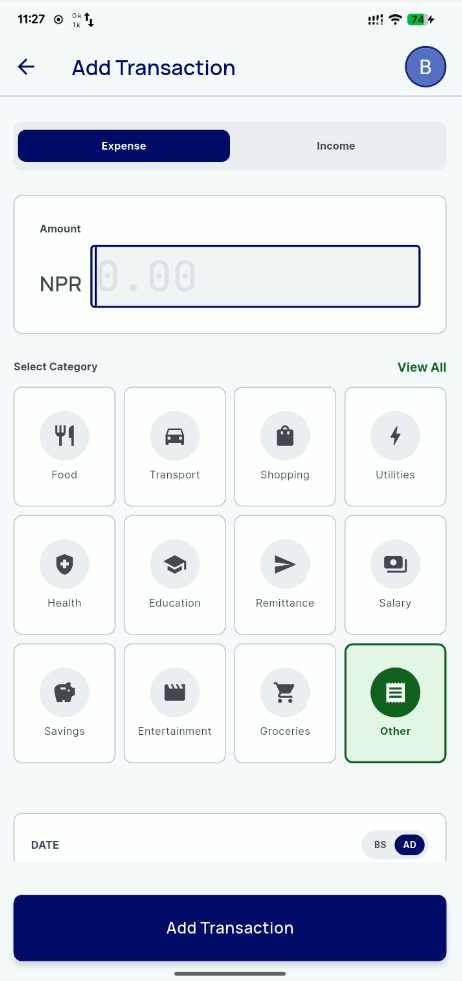 | 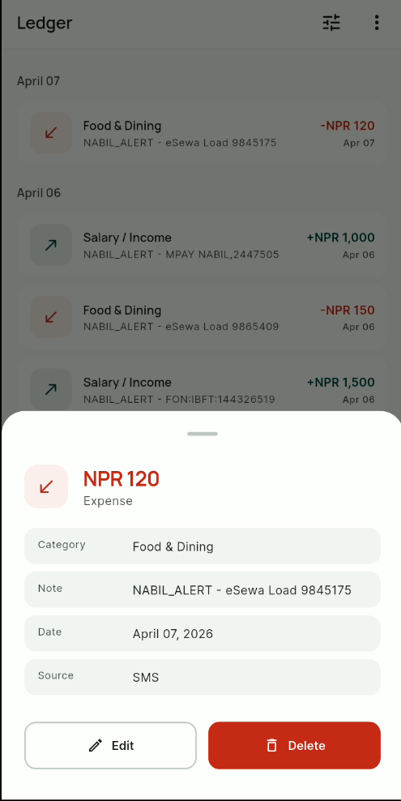 |

### Savings Goals

| Goals | Add Goal | Add Savings | Goal Details |
| :----------------------------------------: | :-------------------------------------------: | :----------------------------------------------: | :-------------------------------------------: |
| 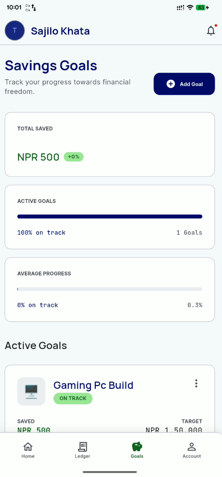 | 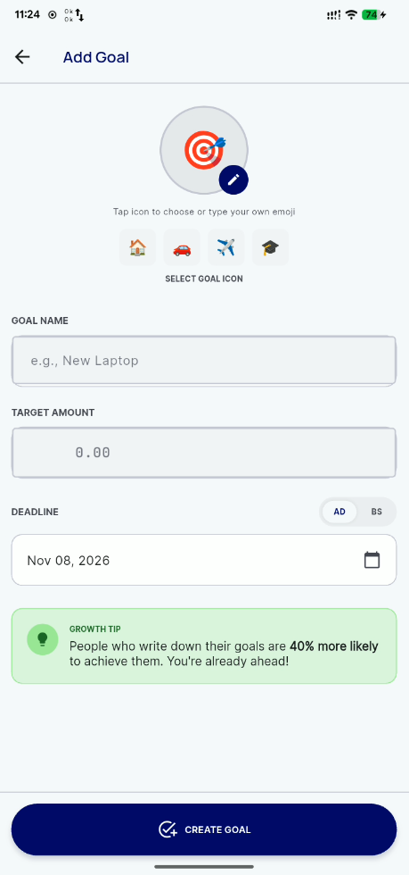 | 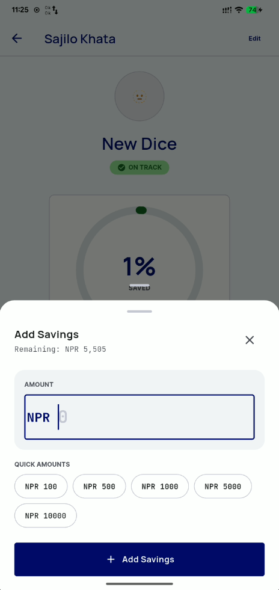 | 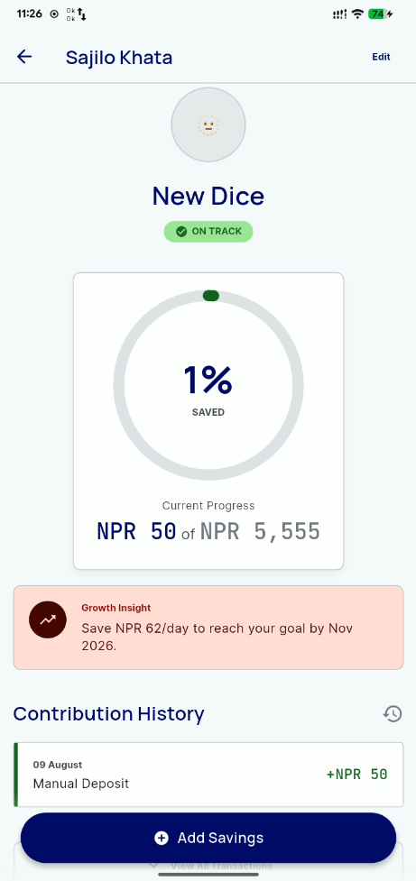 |

### Profile & Settings

| Profile | SMS Auto-Track | Sync Status |
| :-----------------------------------------------: | :------------------------------------------: | :---------------------------------------------------: |
| 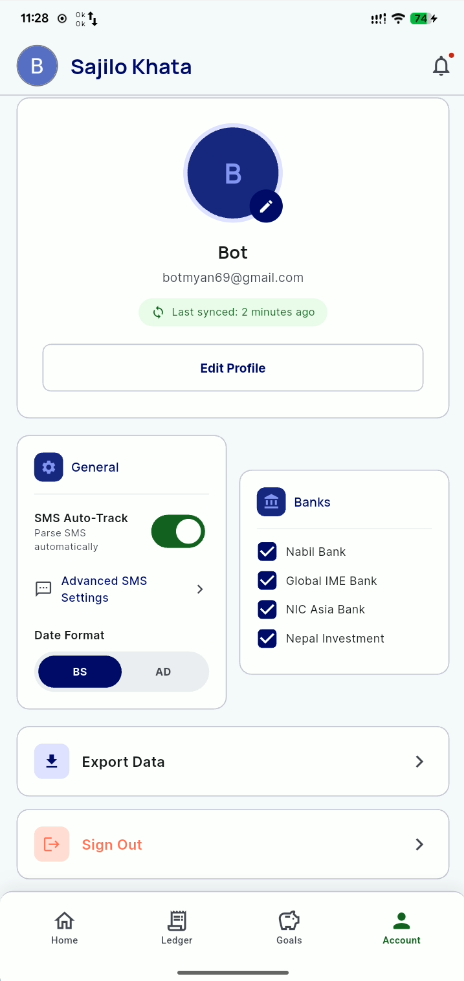 | 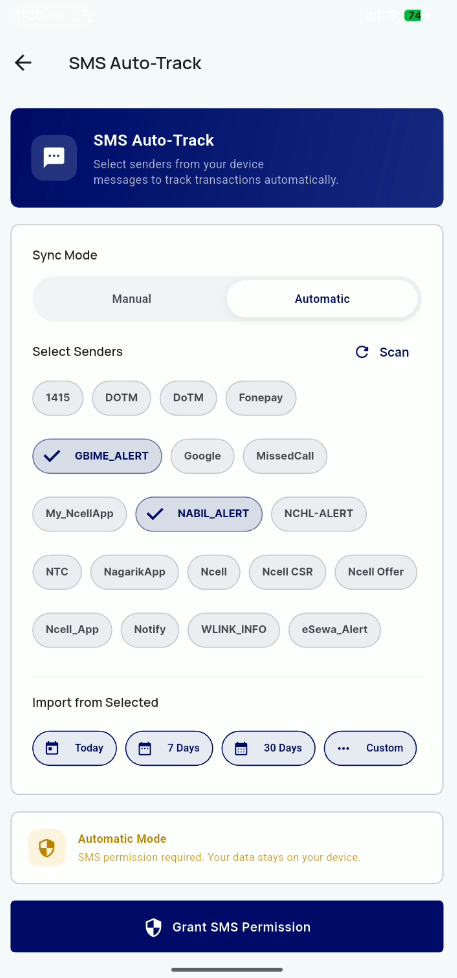 | 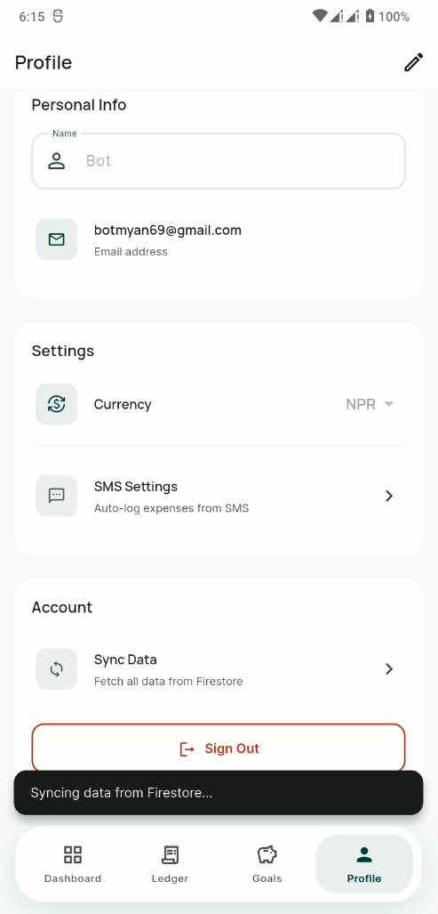 |

### Permissions

| Permission Request 1 | Permission Request 2 |
| :-----------------------------------------------: | :-----------------------------------------------: |
| 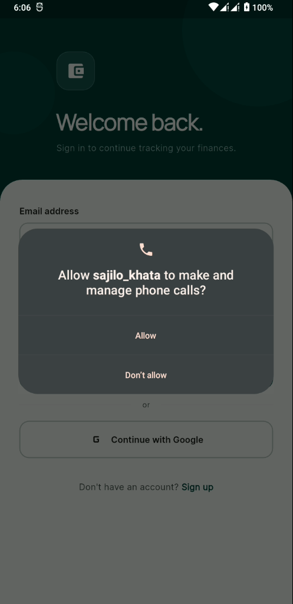 | 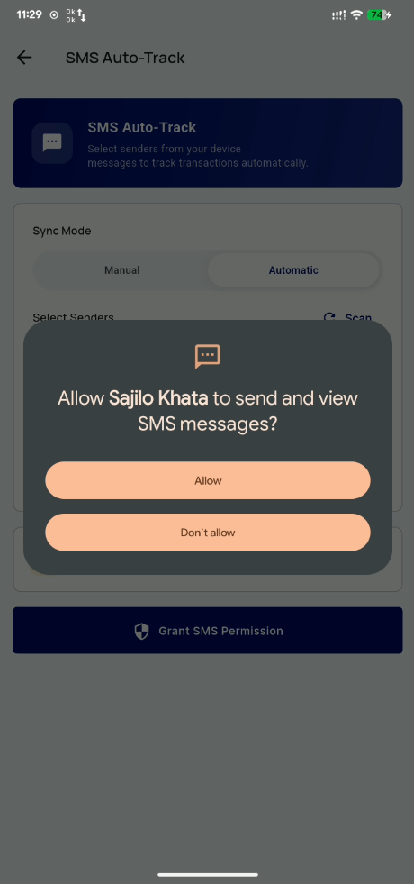 |

## **1.1 Why This App**

- No existing Nepali expense tracker parses bank SMS automatically
- Existing apps have poor UX and lack BS date support
- Real daily utility - used for NPR, designed for Nepali spending patterns

## **1.2 Tech Stack**

| **Layer**            | **Technology**                          |
| -------------------- | --------------------------------------- |
| **UI Framework**     | Flutter 3.x (Dart)                      |
| **State Management** | BLoC pattern (flutter_bloc)             |
| **DI**               | RepositoryProvider + BlocProvider        |
| **Authentication**   | Firebase Auth - Google + Email/Password |
| **Database**         | Cloud Firestore (real-time sync)        |
| **Local Cache**      | Hive (offline-first)                    |
| **Sync Engine**      | Custom SyncService (online/offline)     |
| **SMS Reading**      | android_sms_reader (Android)            |
| **Charts**           | fl_chart                                |
| **Notifications**    | flutter_local_notifications + FCM       |
| **Nepali Dates**     | nepali_calendar_kit (own package)       |
| **ID Generation**    | uuid                                    |
| **Currency API**     | frankfurter.dev (USD ↔ NPR)             |
| **Share**            | share_plus (CSV sharing)                |
| **Network**          | connectivity_plus (online/offline)      |
| **Permissions**      | permission_handler                      |

# **2\. Feature List**

## **2.1 Authentication**

| **Feature**        | **Description**                                 | **Week** |
| ------------------ | ----------------------------------------------- | -------- |
| **Google Sign-In** | One-tap login via Google account                | Week 1   |
| **Email/Password** | Standard email signup and login                 | Week 1   |
| **Profile setup**  | Name, currency preference (NPR default)         | Week 1   |
| **Device sync**    | Login on any device - data loads from Firestore | Week 1   |

## **2.2 SMS Auto-Reader**

| **Feature**         | **Description**                                            | **Week** |
| ------------------- | ---------------------------------------------------------- | -------- |
| **Auto SMS read**   | Reads incoming bank SMS on Android (READ_SMS permission)   | Week 1   |
| **Bank parsers**    | Regex parsers for 7+ Nepal banks and wallets               | Week 1   |
| **Data extraction** | Extracts amount, debit/credit, bank name, datetime         | Week 1   |
| **Manual fallback** | User pastes SMS text - app parses and logs (iOS + unknown) | Week 1   |
| **Unknown SMS**     | Unrecognized messages are silently ignored                 | Week 1   |
| **SMS Groups**      | Select which senders to track (bank filter)                | Week 2   |
| **Auto-toggle**     | Enable/disable auto-tracking in settings                   | Week 2   |

## **2.3 Manual Transactions**

| **Feature**            | **Description**                                          | **Week** |
| ---------------------- | -------------------------------------------------------- | -------- |
| **Add expense/income** | Quick-entry form: amount, category, note, date           | Week 1   |
| **Edit transaction**   | Edit any field of SMS-parsed or manual transactions      | Week 1   |
| **Delete transaction** | Soft delete with confirmation dialog                     | Week 1   |
| **Auto-categorize**    | Keyword matching: Bhatbhateni → Food, Pathao → Transport | Week 1   |

## **2.4 Firebase Sync**

| **Feature**           | **Description**                                               | **Week** |
| --------------------- | ------------------------------------------------------------- | -------- |
| **Firestore storage** | All transactions stored under users/{uid}/transactions        | Week 1   |
| **Offline-first**     | Hive local cache - works without internet, syncs on reconnect | Week 1   |
| **Real-time updates** | Stream-based - UI updates instantly on data change            | Week 1   |

## **2.5 Dashboard & Reports**

| **Feature**          | **Description**                                       | **Week** |
| -------------------- | ----------------------------------------------------- | -------- |
| **Monthly summary**  | Total income, expenses, and net balance for the month | Week 2   |
| **Pie chart**        | Spending breakdown by category (fl_chart)             | Week 2   |
| **Bar chart**        | Daily spend over the last 30 days                     | Week 2   |
| **BS / AD toggle**   | Switch between Bikram Sambat and Gregorian dates      | Week 2   |
| **Transaction list** | Scrollable list - debit in red, credit in green       | Week 2   |
| **Currency convert** | USD ↔ NPR live exchange rate (frankfurter.dev)        | Week 2   |

## **2.6 Savings Goals**

| **Feature**             | **Description**                                         | **Week** |
| ----------------------- | ------------------------------------------------------- | -------- |
| **Create goal**         | Name, emoji, target amount, and deadline (BS or AD)     | Week 2   |
| **Manual contribute**   | Add savings to any goal at any time                     | Week 2   |
| **Auto-contribute**     | On credit SMS, prompt: "Add to a goal?"                 | Week 2   |
| **Progress bar**        | Visual progress with % saved and amount remaining       | Week 2   |
| **Status badge**        | On Track / Behind / Achieved - calculated from deadline | Week 2   |
| **Daily target**        | "Save Rs. X/day" - remaining ÷ days left                | Week 2   |
| **Multiple goals**      | Unlimited goals, sorted by nearest deadline             | Week 2   |
| **Goal achieved alert** | Push notification when 100% is reached                  | Week 2   |

## **2.7 Notifications & Export**

| **Feature**       | **Description**                                       | **Week** |
| ----------------- | ----------------------------------------------------- | -------- |
| **SMS log alert** | Push notification when new transaction is auto-logged | Week 2   |
| **Budget alert**  | Notify at 80% and 100% of monthly budget limit        | Week 2   |
| **Goal alert**    | Celebrate when a savings goal is achieved             | Week 2   |
| **CSV export**    | Export all/expense/income transactions as CSV         | Week 2   |
| **Share**         | Share CSV via any app (share_plus)                    | Week 2   |

# **3\. Project Structure**

The project follows Clean Architecture with three layers (presentation, domain, data) plus a core shared layer.

## **3.1 Top-Level Structure**

| **Path**                    | **Purpose**                                              |
| --------------------------- | -------------------------------------------------------- |
| lib/main.dart               | App entry point - Firebase init, MultiRepositoryProvider, MultiBlocProvider, app router |
| lib/core/                   | Shared: constants, services, DI, network, utils, theme   |
| lib/domain/                 | Entities, repository interfaces, use cases                |
| lib/data/                   | Datasources (Firestore, Hive), repository implementations, data models |
| lib/presentation/           | BLoCs, screens, routes, common widgets, DI providers     |
| pubspec.yaml                | Package dependencies                                     |
| android/AndroidManifest.xml | SMS permissions (READ_SMS, RECEIVE_SMS)                  |

## **3.2 Core Layer**

| **Path**                                 | **Purpose**                                                   |
| ---------------------------------------- | ------------------------------------------------------------- |
| core/constants/app_theme.dart            | Light & dark MaterialTheme definitions                        |
| core/constants/app_constants.dart        | App name, company name (RedPixel Labs)                        |
| core/di/service_locator.dart             | Legacy singleton DI (migration target)                        |
| core/network/network_info.dart           | Connectivity check abstraction                                |
| core/services/firebase_service.dart      | Legacy Firestore CRUD (used by SMS parser)                    |
| core/services/sms_service.dart           | SMS parsing, duplicate check, auto-import                     |
| core/services/notification_service.dart  | Push notifications (FCM + local)                              |
| core/services/sync_service.dart          | Offline/online sync orchestration                             |
| core/services/local_storage_service.dart | Hive local cache for preferences                              |
| core/services/exchange_rate_service.dart | USD ↔ NPR conversion via frankfurter.dev                      |
| core/models/goal_model.dart              | Legacy GoalModel (used by notification/sync services)         |
| core/models/transaction_model.dart       | Legacy TransactionModel (used by SMS parser)                  |

## **3.3 Domain Layer**

| **Path**                                           | **Purpose**                              |
| -------------------------------------------------- | ---------------------------------------- |
| domain/entities/goal.dart                          | Goal entity with progress calculations   |
| domain/entities/transaction.dart                   | Transaction entity                       |
| domain/repositories/i_auth_repository.dart         | Auth repository interface                |
| domain/repositories/i_goal_repository.dart         | Goal repository interface                |
| domain/repositories/i_transaction_repository.dart  | Transaction repository interface         |
| domain/repositories/i_sync_repository.dart         | Sync repository interface                |
| domain/usecases/auth/                              | CheckAuth, SignInEmail, SignInGoogle, SignOut, SignUpEmail |
| domain/usecases/goals/                             | GetGoals, AddGoal, UpdateGoal, DeleteGoal, ContributeToGoal, RemoveContribution, EditContribution |
| domain/usecases/transactions/                      | GetTransactions, AddTransaction, UpdateTransaction, DeleteTransaction |

## **3.4 Data Layer**

| **Path**                                           | **Purpose**                              |
| -------------------------------------------------- | ---------------------------------------- |
| data/datasources/local/hive_datasource.dart        | Hive local cache implementation          |
| data/datasources/remote/firebase_auth_datasource.dart  | Firebase Auth wrapper                |
| data/datasources/remote/firebase_firestore_datasource.dart | Firestore CRUD + streams         |
| data/repositories/auth_repository_impl.dart        | Auth repository implementation           |
| data/repositories/goal_repository_impl.dart        | Goal repository implementation           |
| data/repositories/transaction_repository_impl.dart | Transaction repository implementation    |
| data/repositories/sync_repository_impl.dart        | Sync repository implementation           |
| data/models/goal_model.dart                        | Goal Firestore serialization helpers     |
| data/models/transaction_model.dart                 | Transaction Firestore serialization helpers |

## **3.5 Presentation Layer**

Screens use the Dart `part` / `part of` pattern. Each screen group has a `group_imports.dart` barrel file containing all imports, and screen files use `part of 'group_imports.dart'`.

After login, the splash screen navigates to `/home` which renders a `HomeScreen` scaffold with a 4-tab `BottomNavigationBar` (Dashboard, Transactions, Goals, Profile) using `IndexedStack` to preserve tab state when switching.

### BLoCs

| **Path**                                            | **Purpose**                              |
| --------------------------------------------------- | ---------------------------------------- |
| presentation/bloc/auth/auth_bloc.dart               | Auth state management                    |
| presentation/bloc/auth/auth_event.dart              | Auth events                              |
| presentation/bloc/auth/auth_state.dart              | Auth states                              |
| presentation/bloc/transaction/transaction_bloc.dart | Transaction state management             |
| presentation/bloc/transaction/transaction_event.dart| Transaction events                       |
| presentation/bloc/transaction/transaction_state.dart| Transaction states                       |
| presentation/bloc/goal/goal_bloc.dart               | Goal state management                    |
| presentation/bloc/goal/goal_event.dart              | Goal events                              |
| presentation/bloc/goal/goal_state.dart              | Goal states                              |

### Screens (grouped by feature)

| **Path**                                            | **Purpose**                              |
| --------------------------------------------------- | ---------------------------------------- |
| presentation/screens/home/home_imports.dart          | Home barrel (home.dart)                  |
| presentation/screens/home/home.dart                 | Home scaffold with 4-tab BottomNavigationBar |
| presentation/screens/splash/splash.dart             | Splash screen - auth check on startup    |
| presentation/screens/auth/auth_imports.dart         | Auth barrel (login.dart, signup.dart)    |
| presentation/screens/auth/login.dart                | Login screen                             |
| presentation/screens/auth/signup.dart               | Email signup screen                      |
| presentation/screens/auth/widgets/auth_widgets.dart | Auth UI components                       |
| presentation/screens/dashboard/dashboard_imports.dart| Dashboard barrel                        |
| presentation/screens/dashboard/dashboard.dart       | Monthly summary + charts + quick actions |
| presentation/screens/transactions/transactions_imports.dart | Transactions barrel             |
| presentation/screens/transactions/transaction_list.dart  | Full transaction list with filters |
| presentation/screens/transactions/add_transaction.dart   | Manual add/edit form              |
| presentation/screens/transactions/widgets/transaction_tile.dart | Individual transaction card    |
| presentation/screens/goals/goals_imports.dart       | Goals barrel                             |
| presentation/screens/goals/goals_list.dart          | All savings goals with progress          |
| presentation/screens/goals/add_goal.dart            | Create new goal form                     |
| presentation/screens/goals/goal_detail.dart         | Goal detail + contribution history       |
| presentation/screens/profile/profile_imports.dart   | Profile barrel                           |
| presentation/screens/profile/profile.dart           | Profile management, logout               |
| presentation/screens/sms_settings/sms_settings_imports.dart | SMS Settings barrel             |
| presentation/screens/sms_settings/sms_settings.dart | SMS senders filter, auto-toggle settings |

### DI Providers

| **Path**                                            | **Purpose**                              |
| --------------------------------------------------- | ---------------------------------------- |
| presentation/repository_providers.dart              | All RepositoryProvider definitions       |
| presentation/bloc_providers.dart                    | All BlocProvider definitions             |
| presentation/routes/app_router.dart                 | Named route generator                    |

# **4\. Data Models**

## **4.1 Transaction (Domain Entity)**

| **Field**     | **Type** | **Notes**                              |
| ------------- | -------- | -------------------------------------- |
| **id**        | String   | UUID v4 - Firestore document ID        |
| **amount**    | double   | Transaction amount in NPR              |
| **type**      | enum     | debit or credit                        |
| **source**    | enum     | sms or manual                          |
| **category**  | String   | Auto-assigned or user-selected         |
| **bank**      | String?  | Bank/wallet name from SMS parser       |
| **note**      | String?  | Optional user note or SMS description  |
| **dateAD**    | DateTime | Gregorian transaction date             |
| **dateBS**    | String   | Bikram Sambat date (from calendar kit) |
| **createdAt** | DateTime | Record creation timestamp              |

## **4.2 Goal (Domain Entity)**

| **Field**               | **Type** | **Notes**                            |
| ----------------------- | -------- | ------------------------------------ |
| **id**                  | String   | UUID v4                              |
| **name**                | String   | Goal title e.g. "New Laptop"         |
| **emoji**               | String   | Visual identifier e.g. 🖥️            |
| **targetAmount**        | double   | Total savings needed in NPR          |
| **savedAmount**         | double   | Amount saved so far                  |
| **deadlineAD**          | DateTime | Target date in Gregorian             |
| **deadlineBS**          | String   | Target date in Bikram Sambat         |
| **status**              | enum     | onTrack \| behind \| achieved        |
| **progressPercent**     | double   | Computed: savedAmount / targetAmount |
| **requiredDailyAmount** | double   | Computed: remaining / daysLeft       |

# **5\. Firestore Database Schema**

All user data is scoped under users/{uid}/ to ensure privacy and cross-device sync. Firestore security rules should restrict read/write access to the authenticated owner only.

users/{uid}/ profile: { name, currency, updatedAt } transactions/{txId}: { amount, type, source, category, bank, note, dateAD, dateBS, createdAt } goals/{goalId}: { name, emoji, targetAmount, savedAmount, deadlineAD, deadlineBS, status, createdAt }

## **5.1 Firestore Security Rules**

```
rules_version = '2';
service cloud.firestore {
  match /databases/{database}/documents {
    match /users/{userId}/{document=**} {
      allow read, write: if request.auth != null && request.auth.uid == userId;
    }
  }
}
```

# **6\. SMS Parser**

## **6.1 Supported Banks & Wallets**

| **Bank**          | **Sample SMS Pattern**                                                | **Amount Pattern**   |
| ----------------- | --------------------------------------------------------------------- | -------------------- |
| **NIMB**          | "AC#XXX Dr by NPR 2500 on 01Dec25" / "Cr by NPR 1600"                 | Dr/Cr → debit/credit |
| **NIC Asia**      | "Your #XXXXXX has been Credited by NPR 1,013.45 on 14/04/2026"        | Credited/Debited     |
| **ADB**           | "NPR 15,000.00 deposited on 25/03/2026" / "withdrawn on 26/03/2026"   | deposited/withdrawn  |
| **Nabil**         | "deposited by NPR 1,500.00 on 06/04/2026" / "withdrawn by NPR 120.00" | deposited/withdrawn  |
| **Laxmi Sunrise** | "Your #XXXXXX has been credited by NPR 10,000.00 on 17/04/26"         | Credited/Debited     |

## **6.2 How the Parser Works**

- Check sender name against known bank identifiers
- Look for debit/credit keywords in the message body
- Extract NPR amount using regex: NPR {digits} or Rs. {digits}
- Return ParsedSms(amount, type, bank) or null if unrecognized
- Unknown/promotional SMS are silently ignored - no false entries

# **7\. Android Setup - SMS Permissions**

Add the following to android/app/src/main/AndroidManifest.xml inside the <manifest> tag:

```xml
<uses-permission android:name="android.permission.READ_SMS"/>
<uses-permission android:name="android.permission.RECEIVE_SMS"/>
```

Request permissions at runtime in Flutter:

```dart
import 'package:permission_handler/permission_handler.dart';

Future<void> requestSmsPermission() async {
  await Permission.sms.request();
}
```

Important: Google Play Store requires a Privacy Policy URL and a declaration explaining why READ_SMS is needed. Prepare this before publishing. The review typically takes 3-7 business days.

# **8\. Auto-Category System**

The Categorizer utility in core/utils/categorizer.dart maps keywords in transaction notes or bank names to categories. This list should be expanded over time based on real user data.

| **Category**        | **Sample Keywords**                                   |
| ------------------- | ----------------------------------------------------- |
| **Food & Dining**   | bhatbhateni, foodmandu, cafe, pizza, momo, restaurant |
| **Transport**       | pathao, indrive, tootle, taxi, bus, petrol, fuel      |
| **Shopping**        | daraz, sastodeal, bigmart, fashion, mall              |
| **Utilities**       | nea, ntc, ncell, broadband, dish home                 |
| **Health**          | hospital, clinic, pharmacy, medical                   |
| **Education**       | school, college, tuition, course, exam fee            |
| **Remittance**      | imepay, western union, money transfer, sent to        |
| **Salary / Income** | salary, payroll, wages, bonus                         |

# **9\. Architecture Highlights**

## **9.1 Clean Architecture Layers**

```
Presentation (BLoC + Screens)
    ↕
Domain (Entities + Use Cases + Repository Interfaces)
    ↕
Data (Repository Impls + Datasources + Models)
```

- **Domain** has zero Flutter/Firebase dependencies — pure Dart
- **Data** implements domain interfaces, handles serialization
- **Presentation** uses BLoC pattern with RepositoryProvider DI

## **9.2 Offline-First Data Flow**

```
User Action → BLoC → UseCase → Repository → Local Cache (Hive)
                                               ↓ (if online)
                                           Remote (Firestore)
                                               ↓
                                       Stream updates UI
```

- On first install offline: shows empty state immediately (no infinite spinner)
- On reconnect: SyncService detects connectivity change, syncs pending data
- Hive provides instant reads, Firestore provides real-time updates

## **9.3 Dependency Injection**

```dart
// lib/presentation/repository_providers.dart
MultiRepositoryProvider(
  providers: [
    RepositoryProvider<FirebaseFirestoreDataSource>(...),
    RepositoryProvider<HiveDataSource>(...),
    RepositoryProvider<TransactionRepository>(...),
    RepositoryProvider<GoalRepository>(...),
  ],
  child: MultiBlocProvider(
    providers: [
      BlocProvider<TransactionBloc>(...),
      BlocProvider<GoalBloc>(...),
    ],
    child: MaterialApp(...),
  ),
)
```

This project demonstrates: Clean Architecture, Flutter BLoC patterns, Firebase integration, offline-first data flow, SMS parsing, chart rendering, push notifications, and cross-device sync — all targeting a real market gap in Nepal.

Built by **RedPixel Labs** • gambhirpoudel.com.np